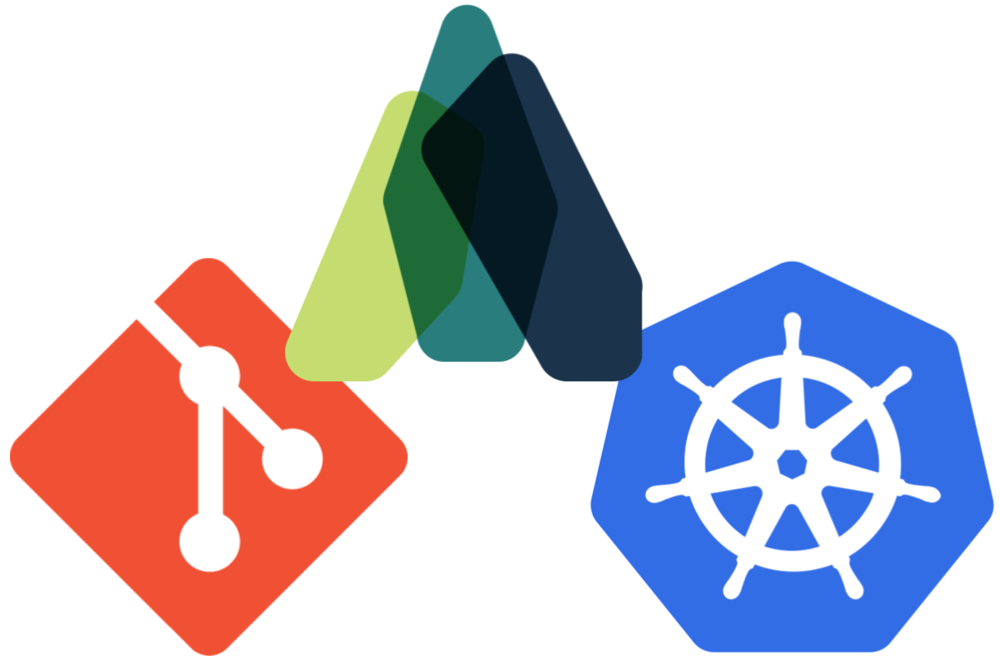
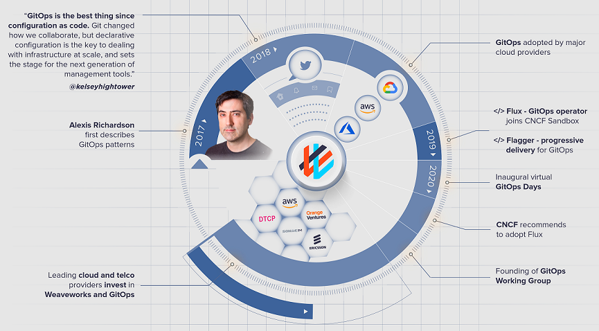
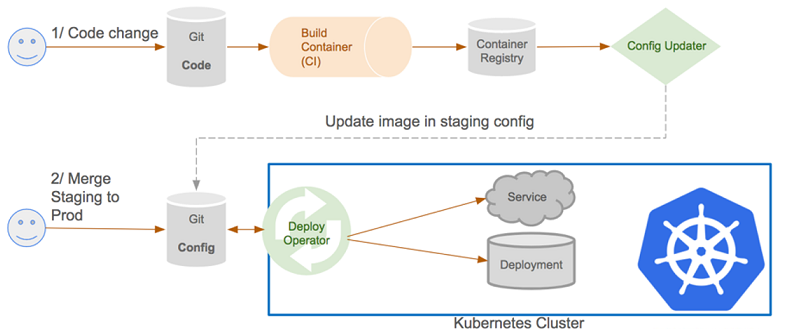
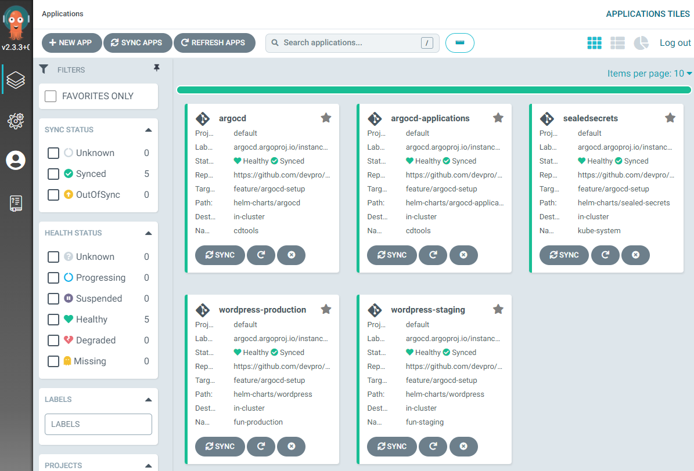

<!--
paginate: false
-->

<!-- _class: lead -->

# GitOps 101

Updated in July 2023

---

## GitOps - What? (GitLab)

> GitOps is an **operational framework** that takes DevOps best practices used for application development such as version control, collaboration, compliance, and CI/CD, and applies them to **infrastructure automation**.

→ [gitlab.com/gitops](https://about.gitlab.com/topics/gitops/)

---

## GitOps - What? (Red Hat)

> GitOps is a **set of practices** to manage infrastructure and application configurations using Git, an open source version control system.  
> GitOps works by using **Git as a single source of truth for declarative infrastructure and applications**.

→ [redhat.com/what-is-gitops](https://www.redhat.com/en/topics/devops/what-is-gitops)

---

## GitOps - When?

---

## GitOps - Why?

* Split application and infrastructure code
* Enable full automation from version control
* Simplify environment creation and configuration
* Apply people responsibility ("Dev", "Ops") to code management

---

## GitOps - How?

---

## Buzzword fight

Word       | Main challenge  | Breakdown
---------- | --------------- | -------------------------------------
**CI/CD**  | Technical       | Continuous automation (pipelines)
**DevOps** | People          | Collaboration practices
**GitOps** | Processes       | Operational framework
**IaC**    | Technical       | Repositories with infrastructure code

---

## CNCF - Projects

> The [CNCF](https://www.cncf.io/) (Cloud Native Computing Foundation) serves as the vendor-neutral home for many of the fastest-growing open source projects.

---

## ArgoCD - Discovery

> [Argo CD](https://argoproj.github.io/cd/) is a declarative, GitOps continuous delivery tool for Kubernetes.

---

## Demonstration

→ [devpro/gitops-samples](https://github.com/devpro/gitops-samples)

---

## Choices of implementation (1/4)

* Kubernetes definition format
  * [Helm](https://helm.sh/)
  * [Kustomize](https://kustomize.io/)
  * Raw manifests

---

## Choices of implementation (2/4)

* Environment strategy
  * one per folder
  * one per git branche
  * one per git repository

---

## Choices of implementation (3/4)

:warning: No secret values in git!

* Secret management tool
  * [Bitnami Sealed Secrets](https://github.com/bitnami-labs/sealed-secrets)
  * [External Secrets](https://external-secrets.io/)

---

## Choices of implementation (4/4)

* GitOps continuous delivery tool for Kubernetes
  * [Argo CD](https://argoproj.github.io/cd/)
  * [Fleet](https://fleet.rancher.io/)
  * [Flux](https://fluxcd.io/)

---

## Getting started

* Get familiar with Helm charts
* Evaluate a set of tools
* Start small in a non-production environment
* Add one new component at a time
* Get regular feedbacks and keep improving

---

## References

* [Promoting changes and releases with GitOps](https://en.sokube.ch/post/promoting-changes-and-releases-with-gitops) by SoKube - January 18, 2022
* [Free eBook on Leanpub](https://leanpub.com/gitops)

---

## Appendix - Helm chart stores

* General
  * [ArtifactHub](https://artifacthub.io/)
  * [Bitnami](https://bitnami.com/stacks/helm)
  * [Devpro](https://github.com/devpro/helm-charts)
* Dedicated (examples)
  * [Grafana](https://grafana.github.io/helm-charts/)
  * [OpenTelemetry](https://github.com/open-telemetry/opentelemetry-helm-charts)
  * [Prometheus](https://prometheus-community.github.io/helm-charts/)
