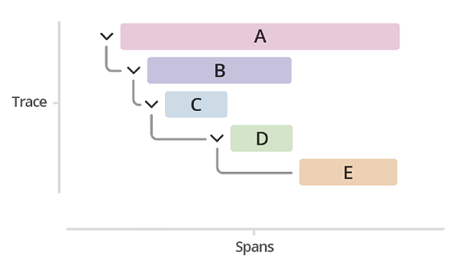

<!--
paginate: false
-->

<!-- _class: lead -->

# Observability 101

Created in April 2022

---

## What is observability? (dynatrace)

> In IT and cloud computing, observability is the ability to measure a system’s current state **based on the data it generates**, such as logs, metrics, and traces.

→ [dynatrace.com/blog](https://www.dynatrace.com/news/blog/what-is-observability-2/)

---

## What is observability? (Splunk)

> Observability is the ability to measure the internal states of a system by **examining its outputs**.

→ [splunk.com](https://www.splunk.com/en_us/data-insider/what-is-observability.html)

---

## Observability vs. monitoring

> **Monitoring** requires you to know what you care about **before** you know you care about it.
>  
> **Observability**, which comes from control theory, allows you to understand your entire system and how it fits together, **and then** use that information to discover what specifically you should care about when it’s most important.

See in details: [image](https://images.ctfassets.net/d3bkzhxwv8fv/5WRzv3j3RumcMvLoX9NFlg/f76c13af987efe6374604ea5d94ceecd/Observability_v_Monitoring_A.png)

→ [lightstep.com](https://lightstep.com/observability-101)

---

## Telemetry data

* Logs
* Metrics
* Traces (distributed tracing)

Aka "The Three Pillars of Observability"

---

### Distributed tracing

* Trace
* Span
* Tags (or SpanContext)

---

## CNCF

> The [CNCF](https://www.cncf.io/) (Cloud Native Computing Foundation) serves as the vendor-neutral home for many of the fastest-growing open source projects.

---

## OpenTelemetry - xxxx

>

---

## Demonstration

---

## Getting started

---

## References

* [Observability: A complete overview for 2021](https://lightstep.com/observability-101) by Lightstep
