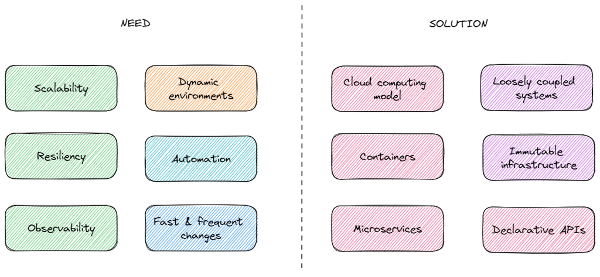
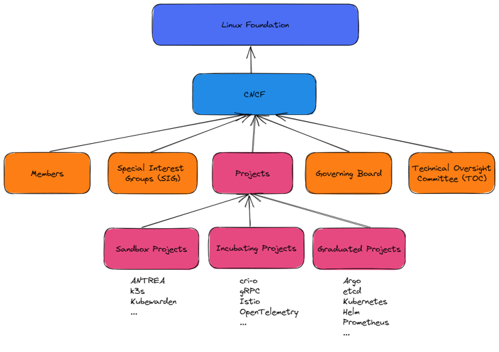

<!--
paginate: false
-->

<!-- _class: lead -->

# Observability 101

Created in April 2022

---

## What is observability? (dynatrace)

> In IT and cloud computing, observability is the ability to measure a system’s current state **based on the data it generates**.

→ [dynatrace.com/blog](https://www.dynatrace.com/news/blog/what-is-observability-2/)

---

## What is observability? (Splunk)

> Observability is the ability to measure the internal states of a system by **examining its outputs**.

→ [splunk.com](https://www.splunk.com/en_us/data-insider/what-is-observability.html)

---

## Observability vs. monitoring

> **Monitoring** requires you to know what you care about **before** you know you care about it.
>  
> **Observability** allows you to understand your entire system and how it fits together, **and then** use that information to discover what specifically you should care about when it’s most important.

→ [lightstep.com](https://lightstep.com/observability-101) ([comparison](https://images.ctfassets.net/d3bkzhxwv8fv/5WRzv3j3RumcMvLoX9NFlg/f76c13af987efe6374604ea5d94ceecd/Observability_v_Monitoring_A.png))

---

## Observability vs. DevOps

---

## Telemetry data

* Logs
* Metrics
* Traces (& distributed tracing)

Aka "The Three Pillars of Observability"

---

## A personal experience

* SSH to Linux servers and **tail** log files
* RDP to Windows servers and open log files in a **text editor**
* Write **custom libraries** to enrich application logs
* Send logs to **Redis** data store to have a fast & decoupled solution
* Parse logs with **Logstash** (with grok filters), store the data in **Elasticsearch** and view them in **Kibana**
* Write **custom HTTP processors** to read/write fields to messages exchanged between microservices
* Migrate to Kubernetes and start collecting metrics with **Prometheus**

---

### Distributed tracing (Tracing Signal)

* Trace
* Span
* SpanContext

---

## Cloud Native

> Cloud native technologies empower organizations to build and run scalable applications in modern, dynamic environments such as public, private, and hybrid clouds. (ref. [CNCF](https://github.com/cncf/foundation/blob/main/charter.md))

---

## CNCF (Cloud Native Computing Foundation)

> The [CNCF](https://www.cncf.io/) serves as the vendor-neutral home for many of the fastest-growing open source projects.

---

## CNCF project velocity in 2022

---

## OpenTelemetry (OTel)

> High-quality, ubiquitous, and portable telemetry to enable effective observability
>  
> OpenTelemetry is a **collection of tools, APIs, and SDKs**. Use it to instrument, generate, collect, and export telemetry data (metrics, logs, and traces) to help you analyze your software’s performance and behavior.

→ [opentelemetry.io](https://opentelemetry.io/), [GitHub](https://github.com/open-telemetry)

---

## Reasons to choose OpenTelemetry

* Open source & vendor neutral
* CNCF active & trending project (merge of OpenCensus and OpenTracing)
* Reliable & decoupled solution
* State of the Art design and implemenation
* Finally a standard, adopted and supported by observability leaders
* Easy to integrate & extend

---

## Architecture of OpenTelemetry

---

## OpenTelemetry Collector

---

## Kubernetes deployment (DaemonSet)

→ [Helm chart](https://github.com/open-telemetry/opentelemetry-helm-charts/tree/main/charts/opentelemetry-collector)

---

## Other OpenTelemetry components

* [Instrumentation](https://opentelemetry.io/docs/instrumentation/)
* [OpenTelemetry Protocol (OTLP)](https://opentelemetry.io/docs/specs/otlp/)
* [Specification](https://opentelemetry.io/docs/reference/specification/) ([code](https://github.com/open-telemetry/opentelemetry-specification))

---

## Demonstration

* Clone [rabbids-incubator/servicenow-dotnet-client](https://github.com/rabbids-incubator/servicenow-dotnet-client)
* Start containers with `docker-compose up`
* Configure and run the sample web API with `dotnet run --project src samples/WebApiSample`
* Make REST API calls from [Swagger page](https://localhost:7079/swagger/index.html)
* Open [local Grafana](http://localhost:3000/) and look at Loki, Prometheus and Tempo exploration pages

---

## Getting started

* Experiment locally with docker compose: OpenTelemetry Collector with Grafana and/or Elastic Stack or Splunk
* Evaluate OpenTelemetry SDK (exporter & instrumentation): [.NET](https://github.com/open-telemetry/opentelemetry-dotnet),
[Python](https://opentelemetry-python.readthedocs.io/en/stable/)

---

## References

* [Observability: A complete overview for 2021](https://lightstep.com/observability-101) by Lightstep
* [Contrib repository for the OpenTelemetry Collector](https://github.com/open-telemetry/opentelemetry-collector-contrib)
* [Cloud Native samples](https://github.com/devpro/cloud-native-samples) by Bertrand Thomas
* [Telegraf](https://github.com/influxdata/telegraf)
