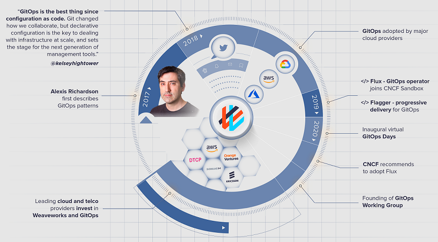
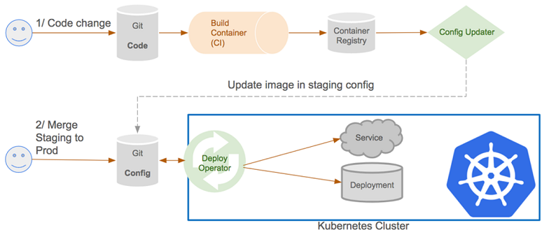

<!--
theme: default
class:
 - invert
headingDivider: 2
paginate: true
-->

<!--
_class:
 - lead
 - invert
-->

# Fun with containers - GitOps 101

Created in April 2022

## GitOps - What?

> GitOps is an operational framework that takes DevOps best practices used for application development such as version control, collaboration, compliance, and CI/CD, and applies them to infrastructure automation [GitLab](https://about.gitlab.com/topics/gitops/)

## GitOps - When?

## GitOps - Why?

* Separate the code from the infrastructure
* Enable full automation
* Ease and version environment configuration
* Simplify operational work

## GitOps - How?

## Buzzword fight

Word | Main impact | Breakdown
---- | ----------- | ---------
**CI/CD** | Technical | Continuous automation (pipelines)
**DevOps** | People | Collaboration practices
**GitOps** | Processes | Operational framework

## ArgoCD - Discovery

> Argo CD is a declarative, GitOps continuous delivery tool for Kubernetes.

[ArgoCD](https://argoproj.github.io/cd/) is one of the most active projects of the [CNCF](https://www.cncf.io/) (Cloud Native Computing Foundation)

## Demonstration

* [devpro/gitops-samples](https://github.com/devpro/gitops-samples)

## Getting started

* Get familiar with Helm charts (or Kustomize)
* Chose a secret management tool
* Start small with one new component at a time on ArgoCD
* Experiment and define the git strategy for environment management

## Choices to make

* Environment strategy?
  * one per folder
  * one per git branche
  * one per git repository

## Secret management

* No secret values in git!
* Use Bitnami "Sealed Secrets" or another mechanism

## Interesting readings

* [Promoting changes and releases with GitOps](https://en.sokube.ch/post/promoting-changes-and-releases-with-gitops)
by SoKube - January 18, 2022
* [Free eBook on Leanpub](https://leanpub.com/gitops)
